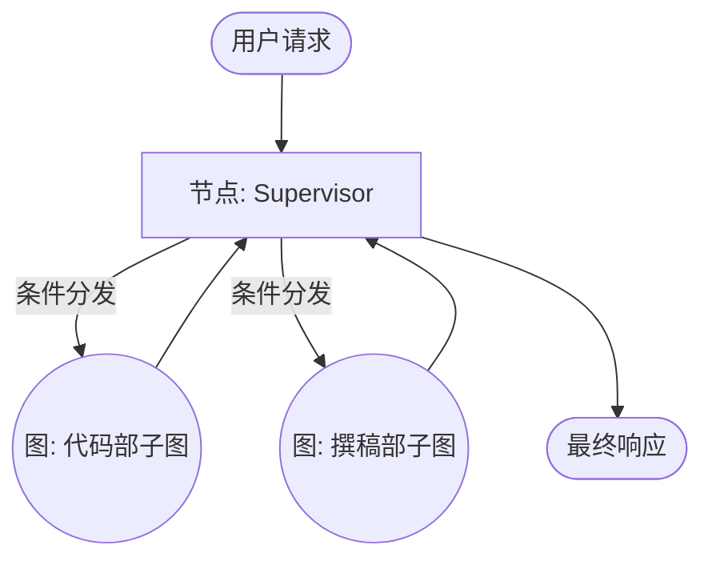

# 第 09 章：实战演练：多智能体协作与质检

## 0. 学习进度预览
| 状态 | 章节名称 | 核心知识点 | 预计难度 |
| :--- | :--- | :--- | :--- |
| 🔄 | **09: 实战演练：多智能体协作与质检** | Multi-Agent, LangSmith Eval, API Deployment | ⭐⭐⭐⭐ |

## 1. 导读与建模 (The Orientation)

- **[知识背景 / Background]**：单一的超级大模型在处理复杂且繁杂的任务时，常常会出现注意力漂移或工具串扰。解决复杂问题的第一性原理是“分而治之”。在 LangGraph 中，多智能体（Multi-Agent）协作顺理成章地表现为嵌套的子图（SubGraph）。
- **[为什么要学 / Why This Matters]**：在 2026 年，没有任何一个严肃的 AI 应用是由单个 prompt 兜底的。“主从路由协作（Supervisor）”和“自动化质检（Eval）”是确保你的大模型工程能在真实生产环境中活下去的双子星。
- **[逻辑全景图 / Overview]**：

- **[学习目标 / Objectives]**：
  1. 理解并掌握使用 LangGraph 的 `SubGraph` 特性构建主从（Supervisor）多智能体架构。
  2. 初步理解 LangSmith Evaluation，知道如何在持续集成环境中拉跑测试打分。
  3. 掌握如何利用 LangServe 将 Graph 转化为一键部署的生产级 API。

---

## 2. 渐进式知识点展开

### 知识点一：多智能体协作与子图嵌套 (Multi-Agent Routing)

多智能体系统的核心理念在于**低耦合、高内聚**。我们不再向单一大脑里塞 100 个互相打架的工具，而是让“主任路由（Supervisor）”根据任务拆解并唤起职责专一的“员工智能体”。

- **💡 原理直觉：互联网大厂的职能部**
  > 就像是一个互联网大厂。老板（Supervisor）作为入口接待需求，但他根本不自己敲代码或画图；他将指令下发给技术部（Coder 子图）和设计部（UI 子图），两个部门独立闭环处理，最后由老板把结果拼接起来交给甲方。

- **🔍 深度注脚：SubGraph（子图）特性的优势**
  > 注意：将其他编译好的子图当作节点（Node）加入主图，不仅使得代码极其整洁，还完美隔离了状态（State）名称空间。英语翻译专员无需看到日文专员的记忆，它们都在各自的状态里冲浪。

- **🚀 代码实现**
```python
from langgraph.graph import StateGraph

# 构建子图 1: 研究员
researcher_graph = StateGraph(ResearchState)
# ... 给研究员配置工具节点 ...
researcher = researcher_graph.compile()

# 构建主图: 组长
supervisor_graph = StateGraph(GlobalState)
# 【魔法操作】把编译好的子图对象当做节点，直接挂在主图上
supervisor_graph.add_node("researcher_team", researcher) 

# 通过条件边让组长路由任务
# ...
```

---

### 知识点二：工业级质检：LangSmith Evaluation

大模型应用最大的梦魇是退化：“改了一个边角的 Prompt，会不会导致核心购物场景崩塌？”在 2026 年，我们绝不允许“蒙着眼睛上线”。

- **💡 原理直觉：大模型的单元测试**
  > 传统代码用 `assert 1+1==2` 做校验，大模型怎么校验？我们引入另一位没参与干活的“裁判大模型”，让它翻看过去的错题本（数据集），客观地给干活的模型打分。

- **🚀 最佳实践：自动化基准**
LangSmith 提供了无缝对接的 Eval 框架，允许你一行代码拉取云端数据集开跑。
```python
from langsmith.evaluation import evaluate, LangChainStringEvaluator

# 1. 准备大模型裁判 (打分专家)
qa_evaluator = LangChainStringEvaluator("qa")

# 2. 从 LangSmith 拉取错题本（数据），对我们的 agent 进行拉网式跑测
results = evaluate(
    lambda x: agent.invoke(x),       # 受试者（我们的 Agent）
    data="my-production-dataset",    # LangSmith 上的测试数据集
    evaluators=[qa_evaluator],       # 引入打分裁判
    experiment_prefix="v1.2_update"  # 实验批次号标记
)
```

---

### 知识点三：从 Notebook 到 API 交付 (LangServe)

当我们在 Jupyter Notebook 中打磨好模型后，这是交付的最后一程。

- **💡 原理直觉：一键 RESTful 包装工厂**
  > `LangServe` 是一个包装工厂。无论你写出了多么狂野的 Graph，只要通过它的安检机，出来立马变成标准的、能处理高并发的云端 API。 

- **🚀 最佳实践**
只需两行代码，即可将 `Runnable`（无论多复杂的图都是一个大 Runnable）转化为生产级 FastAPI 接口：

```python
from fastapi import FastAPI
from langserve import add_routes

app = FastAPI(title="Company Agent API")

# 无缝挂接已经编译好的 LangGraph
add_routes(app, compiled_graph, path="/my-multi-agent")

# uvicorn server:app 即可启动服务
```

---

## 🚀 实验验证 (Lab)

请打开 `09_Multi_Agent_Eval.ipynb` 文件，开始我们最终的实战验收：

1. 实现一个微型的“翻译小组”主从协作网络。
2. (可选) 到 LangSmith 平台上创建一个包含三条英日语指令语料的数据集。
3. 将我们前几章的工程理念在此融会贯通。

*The Future is Built by Agents.*
---
*Antigravity 教学规范体系 (2026).*
