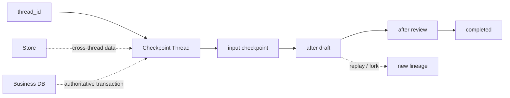

# 第 09 章：关掉进程，研究任务还能回来吗

<!-- lesson-contract:v2 -->

> **课程位置**：Graph 编排层第 3 章
> **锁定环境**：Python 3.12 / LangGraph 1.2.x / langgraph-checkpoint-sqlite 3.x
> **本章工件**：Checkpointer、Thread、StateSnapshot、history、time travel、SQLite 重启与 State migration

## 1. 第 08 章留下了一份临时现场

第 08 章的研究助手已经会拆分任务、并行检索、汇总、审查和修订。运行结束时，`result` 里有一份完整报告。先不要急着庆祝，关掉 Python 进程再看。

长任务会遇到部署、崩溃、人工等待和 worker 迁移。进程一停，只保存聊天文本就回答不了当前 State、下一节点、已完成的并行任务和等待中的 interrupt。

本章要保存的是“执行现场”。LangGraph 的 Checkpointer 会在每个 superstep 边界记录 `StateSnapshot`。`thread_id` 定位一条 checkpoint 链，链上的旧快照可以查看、重放或分叉。


```mermaid
flowchart LR
    ID["thread_id"] --> T["Checkpoint Thread"]
    T --> C0["input checkpoint"]
    C0 --> C1["after draft"]
    C1 --> C2["after review"]
    C2 --> C3["completed"]
    C1 -. "replay / fork" .-> ALT["new lineage"]
    STORE["Store"] -. "cross-thread data" .-> T
    DB["Business DB"] -. "authoritative transaction" .-> T
```

**图的文本替代**：thread ID 定位一条 checkpoint 链，每个 superstep 形成快照。历史快照可以形成新分支；Store 与业务数据库是独立边界，不属于 checkpoint 链。

## 2. 返回值还在，执行现场却找不到了

没有 Checkpointer，`invoke` 也会正常返回。这个顺利的结果很有迷惑性：`result` 只属于刚才那次函数调用，新建的 Graph 对上一轮一无所知。

<!-- lesson-lab:id=ch09-result-only-failure layer=concept kind=failure concept=checkpoint-basics pair=graph-state-persistence -->
### 只有返回值，get_state 无处查询

**运行前先预测**：无 checkpointer 的 Graph 完成后，用 thread 配置调用 `get_state` 会得到刚才的结果吗？

```python sync=ch09-result-only-failure
from typing import TypedDict

from langgraph.graph import END, START, StateGraph


class DraftState(TypedDict, total=False):
    topic: str
    draft: str
    status: str


def build_draft_graph(checkpointer=None):
    builder = StateGraph(DraftState)
    builder.add_node(
        "draft",
        lambda state: {
            "draft": f"draft:{state['topic']}",
            "status": "completed",
        },
    )
    builder.add_edge(START, "draft")
    builder.add_edge("draft", END)
    return builder.compile(checkpointer=checkpointer)


graph = build_draft_graph()
result = graph.invoke({"topic": "checkpoint"})
config = {"configurable": {"thread_id": "draft-001"}}
try:
    graph.get_state(config)
except ValueError as error:
    state_available = False
    error_type = type(error).__name__
else:
    state_available = True
    error_type = "none"

print("invoke_status =", result["status"])
print("state_available =", state_available)
print("error_type =", error_type)
```

**观察结果**：

```text output=ch09-result-only-failure
invoke_status = completed
state_available = False
error_type = ValueError
```

**发生了什么**：`result` 是当前调用的返回值。要恢复执行，还需要 next、tasks、pending writes 和 checkpoint lineage。没有 checkpointer，Graph 就没有这些现场信息。

**动手修改**：把 result 写成 JSON 文件。列出它仍缺少的 `next`、tasks、lineage 与 pending writes，说明“保存最终 State”为什么不等于 checkpoint 协议。
<!-- /lesson-lab -->

<!-- lesson-lab:id=ch09-memory-checkpointer-repair layer=concept kind=repair concept=checkpoint-basics pair=graph-state-persistence -->
### 编译时注入 InMemorySaver

**运行前先预测**：同一个 Graph 和 saver 内，用 thread ID 查询时，`values` 与 `next` 分别是什么？

```python sync=ch09-memory-checkpointer-repair
from typing import TypedDict

from langgraph.checkpoint.memory import InMemorySaver
from langgraph.graph import END, START, StateGraph


class DraftState(TypedDict, total=False):
    topic: str
    draft: str
    status: str


builder = StateGraph(DraftState)
builder.add_node(
    "draft",
    lambda state: {
        "draft": f"draft:{state['topic']}",
        "status": "completed",
    },
)
builder.add_edge(START, "draft")
builder.add_edge("draft", END)
saver = InMemorySaver()
graph = builder.compile(checkpointer=saver)
config = {"configurable": {"thread_id": "draft-001"}}
graph.invoke({"topic": "checkpoint"}, config=config)
snapshot = graph.get_state(config)

print("snapshot_values =", snapshot.values)
print("next_nodes =", snapshot.next)
print("completed =", snapshot.next == ())
```

**观察结果**：

```text output=ch09-memory-checkpointer-repair
snapshot_values = {'topic': 'checkpoint', 'draft': 'draft:checkpoint', 'status': 'completed'}
next_nodes = ()
completed = True
```

**发生了什么**：compiled Graph 把每一步交给 Checkpointer，并用 thread ID 串成一条链。当前快照既保存 State，也保存下一步。完成态没有待执行节点，所以 `next` 是空元组。

`InMemorySaver` 适合语义实验和测试，但数据仍属于当前 saver 对象。它证明 checkpoint 机制，不证明进程重启。

**动手修改**：给图增加 review 节点，比较 history 数量与每个 snapshot 的 next。不要依赖固定下标查找某一步。
<!-- /lesson-lab -->

## 3. Checkpointer 也需要一张取件单

同一个 Checkpointer 会保存许多任务。每次调用都要给出 `thread_id`，否则它不知道该把新快照接到哪条链上。这里先把它看作取件地址，不要把它当成登录用户身份。

<!-- lesson-lab:id=ch09-missing-thread-id-failure layer=concept kind=failure concept=checkpoint-thread pair=thread-address -->
### 配置 saver 后省略 thread_id

**运行前先预测**：框架会自动生成一个不可见 ID，还是 fail closed？

```python sync=ch09-missing-thread-id-failure
from typing import TypedDict

from langgraph.checkpoint.memory import InMemorySaver
from langgraph.graph import END, START, StateGraph


class ThreadState(TypedDict, total=False):
    value: str


builder = StateGraph(ThreadState)
builder.add_node("save", lambda state: state)
builder.add_edge(START, "save")
builder.add_edge("save", END)
graph = builder.compile(checkpointer=InMemorySaver())
try:
    graph.invoke({"value": "没有地址"})
except ValueError as error:
    rejected = True
    mentions_thread_id = "thread_id" in str(error)
else:
    rejected = False
    mentions_thread_id = False

print("rejected =", rejected)
print("mentions_thread_id =", mentions_thread_id)
print("anonymous_checkpoint_created =", False)
```

**观察结果**：

```text output=ch09-missing-thread-id-failure
rejected = True
mentions_thread_id = True
anonymous_checkpoint_created = False
```

**发生了什么**：框架选择了拒绝调用。若每次偷偷生成一个随机 ID，数据虽然写进后端，应用却再也找不到它。恢复地址必须由产品层创建、返回并持有。

**动手修改**：在应用层生成 UUID 并返回客户端。再列出 Gateway 必须保存的 owner 信息，说明 thread ID 为何不能充当认证凭证。
<!-- /lesson-lab -->

<!-- lesson-lab:id=ch09-thread-isolation-repair layer=concept kind=repair concept=checkpoint-thread pair=thread-address -->
### 同一个 saver 隔离两个 thread

**运行前先预测**：thread-a 与 thread-b 使用同一 compiled Graph 时，当前 State 会互相覆盖吗？

```python sync=ch09-thread-isolation-repair
from typing import TypedDict

from langgraph.checkpoint.memory import InMemorySaver
from langgraph.graph import END, START, StateGraph


class ThreadState(TypedDict, total=False):
    value: str


builder = StateGraph(ThreadState)
builder.add_node("save", lambda state: state)
builder.add_edge(START, "save")
builder.add_edge("save", END)
graph = builder.compile(checkpointer=InMemorySaver())
thread_a = {"configurable": {"thread_id": "thread-a"}}
thread_b = {"configurable": {"thread_id": "thread-b"}}
graph.invoke({"value": "A 的研究"}, config=thread_a)
graph.invoke({"value": "B 的研究"}, config=thread_b)

print("thread_a_value =", graph.get_state(thread_a).values["value"])
print("thread_b_value =", graph.get_state(thread_b).values["value"])
print("same_user_required =", False)
```

**观察结果**：

```text output=ch09-thread-isolation-repair
thread_a_value = A 的研究
thread_b_value = B 的研究
same_user_required = False
```

**发生了什么**：同一 saver 按 thread ID 隔离 checkpoint 链。它只认识地址，不认识地址的主人。一个用户可以有多个 thread，用户之间的访问控制仍由 Gateway 负责。

**动手修改**：交换两个 config 查询结果，模拟 IDOR 越权。写出 Gateway 在调用 `get_state` 前必须执行的 owner 检查。
<!-- /lesson-lab -->

## 4. 换一个 saver，刚才的 thread 就空了

只重建 compiled Graph 不算重启实验。若它们共用同一个 saver 对象，数据仍躺在旧内存里。下面连 saver 一起更换。

<!-- lesson-lab:id=ch09-memory-restart-failure layer=concept kind=failure concept=durable-backend pair=process-restart -->
### 换一个 InMemorySaver 后 thread 变空

**运行前先预测**：新 saver 使用同一个 thread ID，是否能读取旧 saver 的 State？

```python sync=ch09-memory-restart-failure
from typing import TypedDict

from langgraph.checkpoint.memory import InMemorySaver
from langgraph.graph import END, START, StateGraph


class RestartState(TypedDict, total=False):
    value: str


def build_graph(saver):
    builder = StateGraph(RestartState)
    builder.add_node("save", lambda state: state)
    builder.add_edge(START, "save")
    builder.add_edge("save", END)
    return builder.compile(checkpointer=saver)


config = {"configurable": {"thread_id": "restart-001"}}
first_graph = build_graph(InMemorySaver())
first_graph.invoke({"value": "进程一的状态"}, config=config)

restarted_graph = build_graph(InMemorySaver())
recovered = restarted_graph.get_state(config)
print("first_value =", first_graph.get_state(config).values["value"])
print("restarted_values =", recovered.values)
print("survived_new_saver =", bool(recovered.values))
```

**观察结果**：

```text output=ch09-memory-restart-failure
first_value = 进程一的状态
restarted_values = {}
survived_new_saver = False
```

**发生了什么**：相同的 thread ID 只提供地址，不能凭空生成内容。`InMemorySaver` 的数据跟着 Python 对象一起消失，适合测试语义，不适合证明跨进程恢复。

**动手修改**：复用旧 saver 但重建 Graph，观察数据仍存在。准确说明你验证的是“Graph 重编译”，不是“持久后端重启”。
<!-- /lesson-lab -->

<!-- lesson-lab:id=ch09-sqlite-restart-repair layer=concept kind=repair concept=durable-backend pair=process-restart -->
### 关闭 SQLite 连接，再创建 saver 与 Graph

**运行前先预测**：旧连接关闭后，新 `SqliteSaver` 能否通过同一 thread ID 找回 State？

```python sync=ch09-sqlite-restart-repair
from pathlib import Path
import tempfile
from typing import TypedDict

from langgraph.checkpoint.sqlite import SqliteSaver
from langgraph.graph import END, START, StateGraph


class RestartState(TypedDict, total=False):
    value: str


def build_graph(saver):
    builder = StateGraph(RestartState)
    builder.add_node("save", lambda state: state)
    builder.add_edge(START, "save")
    builder.add_edge("save", END)
    return builder.compile(checkpointer=saver)


with tempfile.TemporaryDirectory() as directory:
    path = Path(directory) / "checkpoints.sqlite"
    config = {"configurable": {"thread_id": "sqlite-restart-001"}}
    with SqliteSaver.from_conn_string(str(path)) as first_saver:
        first_graph = build_graph(first_saver)
        first_graph.invoke({"value": "SQLite 中的状态"}, config=config)

    with SqliteSaver.from_conn_string(str(path)) as reopened_saver:
        restarted_graph = build_graph(reopened_saver)
        snapshot = restarted_graph.get_state(config)

print("recovered_value =", snapshot.values["value"])
print("next_nodes =", snapshot.next)
print("survived_reopen =", snapshot.values["value"] == "SQLite 中的状态")
```

**观察结果**：

```text output=ch09-sqlite-restart-repair
recovered_value = SQLite 中的状态
next_nodes = ()
survived_reopen = True
```

**发生了什么**：旧连接已经关闭，新 saver 和新 Graph 仍从同一个 SQLite 文件找回快照。现在验证的才是“执行现场跨实例存在”。

这仍不是生产证明。多 worker、连接池、备份、加密、Schema migration 和故障切换，都需要各自的实验与运维约束。

**动手修改**：使用另一个 SQLite 文件路径重启。解释“thread ID 相同”为什么不能跨错误数据库恢复。
<!-- /lesson-lab -->

## 5. 一份快照还要回答“接下来做什么”

`get_state(config)` 返回当前 `StateSnapshot`。先看字段，再看它们如何帮助恢复：

- `values`：该 checkpoint 的 State channels；
- `next`：下一步节点；空元组表示完成；
- `tasks`：待执行 task、错误和 interrupts；
- `config`：thread、checkpoint 与 namespace 标识；
- `metadata`：step、source、writes 等执行信息。

<!-- lesson-lab:id=ch09-snapshot-anatomy layer=concept kind=baseline concept=state-snapshot -->
### 查看完成态快照与 checkpoint ID

**运行前先预测**：一次两节点 Graph 完成后，当前快照的 next 是最后节点，还是空元组？

```python sync=ch09-snapshot-anatomy
from typing import TypedDict

from langgraph.checkpoint.memory import InMemorySaver
from langgraph.graph import END, START, StateGraph


class SnapshotState(TypedDict, total=False):
    draft: str
    status: str


builder = StateGraph(SnapshotState)
builder.add_node("draft", lambda state: {"draft": "初稿"})
builder.add_node("finalize", lambda state: {"status": "completed"})
builder.add_edge(START, "draft")
builder.add_edge("draft", "finalize")
builder.add_edge("finalize", END)
graph = builder.compile(checkpointer=InMemorySaver())
config = {"configurable": {"thread_id": "snapshot-001"}}
graph.invoke({}, config=config)
snapshot = graph.get_state(config)

print("value_keys =", sorted(snapshot.values))
print("next_nodes =", snapshot.next)
print("task_count =", len(snapshot.tasks))
print("checkpoint_id_present =", bool(
    snapshot.config["configurable"].get("checkpoint_id")
))
```

**观察结果**：

```text output=ch09-snapshot-anatomy
value_keys = ['draft', 'status']
next_nodes = ()
task_count = 0
checkpoint_id_present = True
```

**发生了什么**：完成态没有待执行节点或 task，但仍有 checkpoint ID 与完整 values。暂停或失败快照会让 next/tasks 带上恢复信息。

**动手修改**：让 finalize 抛出异常，检查 history 中最近成功快照的 next 与 tasks。不要把异常输出留在正式 Notebook。
<!-- /lesson-lab -->

## 6. 要重放哪一步，先沿 history 找到它

`get_state_history` 通常按新到旧返回快照。不要记“倒数第三个是 finalize 前”，因为增加节点或并行分支就会改变下标。应按 `next`、metadata 或业务状态寻找目标。

<!-- lesson-lab:id=ch09-checkpoint-history layer=concept kind=baseline concept=checkpoint-history -->
### 用 next 查找 finalize 前的快照

**运行前先预测**：history 中每个 snapshot 是否拥有唯一 checkpoint ID？能否找到 `next == ('finalize',)`？

```python sync=ch09-checkpoint-history
from typing import TypedDict

from langgraph.checkpoint.memory import InMemorySaver
from langgraph.graph import END, START, StateGraph


class HistoryState(TypedDict, total=False):
    draft: str
    status: str


builder = StateGraph(HistoryState)
builder.add_node("draft", lambda state: {"draft": "初稿"})
builder.add_node("finalize", lambda state: {"status": "completed"})
builder.add_edge(START, "draft")
builder.add_edge("draft", "finalize")
builder.add_edge("finalize", END)
graph = builder.compile(checkpointer=InMemorySaver())
config = {"configurable": {"thread_id": "history-001"}}
graph.invoke({}, config=config)
history = list(graph.get_state_history(config))
checkpoint_ids = [
    snapshot.config["configurable"]["checkpoint_id"]
    for snapshot in history
]
before_finalize = next(
    snapshot for snapshot in history if snapshot.next == ("finalize",)
)

print("history_has_multiple_steps =", len(history) >= 3)
print("checkpoint_ids_unique =", len(checkpoint_ids) == len(set(checkpoint_ids)))
print("before_finalize_values =", before_finalize.values)
print("before_finalize_next =", before_finalize.next)
```

**观察结果**：

```text output=ch09-checkpoint-history
history_has_multiple_steps = True
checkpoint_ids_unique = True
before_finalize_values = {'draft': '初稿'}
before_finalize_next = ('finalize',)
```

**发生了什么**：每个 checkpoint config 都指向一处历史位置。先用业务条件找到它，后面的 replay、fork 或人工修正才不会依赖脆弱下标。

**动手修改**：插入 review 节点。继续用 `next` 查找，而不是修改硬编码 history 下标。
<!-- /lesson-lab -->

<!-- lesson-lab:id=ch09-time-travel layer=concept kind=baseline concept=time-travel -->
### 从 finalize 前重放纯 State 节点

**运行前先预测**：以历史 snapshot.config 调用 `invoke(None)`，会修改旧 checkpoint，还是形成新的 lineage？

```python sync=ch09-time-travel
from typing import TypedDict

from langgraph.checkpoint.memory import InMemorySaver
from langgraph.graph import END, START, StateGraph


class ReplayState(TypedDict, total=False):
    draft: str
    status: str


builder = StateGraph(ReplayState)
builder.add_node("draft", lambda state: {"draft": "初稿"})
builder.add_node("finalize", lambda state: {"status": "completed"})
builder.add_edge(START, "draft")
builder.add_edge("draft", "finalize")
builder.add_edge("finalize", END)
graph = builder.compile(checkpointer=InMemorySaver())
config = {"configurable": {"thread_id": "replay-001"}}
graph.invoke({}, config=config)
before_finalize = next(
    snapshot
    for snapshot in graph.get_state_history(config)
    if snapshot.next == ("finalize",)
)
original_checkpoint_id = before_finalize.config["configurable"]["checkpoint_id"]
replayed = graph.invoke(None, config=before_finalize.config)
latest = graph.get_state(config)

print("replayed_status =", replayed["status"])
print("latest_status =", latest.values["status"])
print("new_checkpoint_created =", (
    latest.config["configurable"]["checkpoint_id"] != original_checkpoint_id
))
```

**观察结果**：

```text output=ch09-time-travel
replayed_status = completed
latest_status = completed
new_checkpoint_created = True
```

**发生了什么**：time travel 从历史快照的 next tasks 继续，并创建新的 checkpoint 分支。旧历史没有被覆盖，外部数据库的时间也没有倒退。

本例 finalize 只写 State，所以重放安全。外部副作用需要幂等键、outbox 或事务边界，第 10 章会用重复发布实验继续推导。

**动手修改**：在 finalize 中向外部 list append。重放后观察重复项，但不要把这种副作用实现带进生产节点。
<!-- /lesson-lab -->

## 7. 新代码启动了，旧 thread 却在恢复时崩溃

Checkpoint 会长期保存旧版 State。字段新增、改名，或者 `draft` 从字符串升级为领域对象后，新节点若直接假定新版类型，错误要等旧 thread 恢复时才出现。

<!-- lesson-lab:id=ch09-old-state-shape-failure layer=concept kind=failure concept=state-migration pair=checkpoint-schema-version -->
### 新节点把旧字符串当成 DraftDocument

**运行前先预测**：旧图保存 `draft: str`，新节点直接访问 `.content` 时，错误会在编译期还是恢复期出现？

```python sync=ch09-old-state-shape-failure
from typing import TypedDict

from langgraph.checkpoint.memory import InMemorySaver
from langgraph.graph import END, START, StateGraph


class LegacyState(TypedDict, total=False):
    schema_version: int
    draft: object
    rendered: str


saver = InMemorySaver()
config = {"configurable": {"thread_id": "legacy-001"}}
legacy_builder = StateGraph(LegacyState)
legacy_builder.add_node("save", lambda state: state)
legacy_builder.add_edge(START, "save")
legacy_builder.add_edge("save", END)
legacy_graph = legacy_builder.compile(checkpointer=saver)
legacy_graph.invoke(
    {"schema_version": 1, "draft": "旧 Markdown 草稿"},
    config=config,
)

new_builder = StateGraph(LegacyState)
new_builder.add_node(
    "render",
    lambda state: {"rendered": state["draft"].content},
)
new_builder.add_edge(START, "render")
new_builder.add_edge("render", END)
new_graph = new_builder.compile(checkpointer=saver)
try:
    new_graph.invoke({}, config=config)
except AttributeError as error:
    failed_on_resume = True
    error_type = type(error).__name__
else:
    failed_on_resume = False
    error_type = "none"

print("stored_draft_type =", type(legacy_graph.get_state(config).values["draft"]).__name__)
print("failed_on_resume =", failed_on_resume)
print("error_type =", error_type)
```

**观察结果**：

```text output=ch09-old-state-shape-failure
stored_draft_type = str
failed_on_resume = True
error_type = AttributeError
```

**发生了什么**：`TypedDict` 只帮助静态检查，不会改写数据库里的历史值。新图可以顺利编译，旧 thread 进入新节点时才暴露不兼容。

**动手修改**：只给新版类型增加默认值。解释为什么默认值无法改写 checkpoint 中已经存在的旧字符串。
<!-- /lesson-lab -->

<!-- lesson-lab:id=ch09-state-migration-repair layer=concept kind=repair concept=state-migration pair=checkpoint-schema-version -->
### 先按 schema_version 升级，再运行新版节点

**运行前先预测**：migration 节点应调用模型重写旧内容，还是做确定性类型转换？

```python sync=ch09-state-migration-repair
from typing import TypedDict

from langgraph.checkpoint.memory import InMemorySaver
from langgraph.graph import END, START, StateGraph
from pydantic import BaseModel


class DraftDocument(BaseModel):
    content: str
    media_type: str = "text/markdown"


class VersionedState(TypedDict, total=False):
    schema_version: int
    draft: str | DraftDocument
    rendered: str
    migration_status: str


saver = InMemorySaver()
config = {"configurable": {"thread_id": "migration-001"}}
old_builder = StateGraph(VersionedState)
old_builder.add_node("save", lambda state: state)
old_builder.add_edge(START, "save")
old_builder.add_edge("save", END)
old_builder.compile(checkpointer=saver).invoke(
    {"schema_version": 1, "draft": "旧 Markdown 草稿"},
    config=config,
)


def migrate(state: VersionedState) -> dict[str, object]:
    if state.get("schema_version") == 1 and isinstance(state.get("draft"), str):
        return {
            "schema_version": 2,
            "draft": DraftDocument(content=state["draft"]),
            "migration_status": "migrated",
        }
    return {"migration_status": "unchanged"}


new_builder = StateGraph(VersionedState)
new_builder.add_node("migrate", migrate)
new_builder.add_node(
    "render",
    lambda state: {"rendered": state["draft"].content},
)
new_builder.add_edge(START, "migrate")
new_builder.add_edge("migrate", "render")
new_builder.add_edge("render", END)
new_graph = new_builder.compile(checkpointer=saver)
result = new_graph.invoke({}, config=config)

print("schema_version =", result["schema_version"])
print("draft_type =", type(result["draft"]).__name__)
print("rendered =", result["rendered"])
print("migration_status =", result["migration_status"])
```

**观察结果**：

```text output=ch09-state-migration-repair
schema_version = 2
draft_type = DraftDocument
rendered = 旧 Markdown 草稿
migration_status = migrated
```

**发生了什么**：迁移节点先读版本，再做确定性的类型转换，最后把新版对象交给业务节点。迁移结果也会形成 checkpoint，因此可以测试、审计和重复执行。

如果旧图把整个状态存为一个 root channel，而新图拆成多个 channel，普通节点迁移可能不够，需要离线 checkpoint ETL。

**动手修改**：再次调用新图，确保 migration_status 变为 unchanged。设计迁移幂等性与回滚窗口。
<!-- /lesson-lab -->

## 8. 四类数据不能塞进同一张“memory”表

| 组件 | 典型主键 | 保存什么 | 不保存什么 |
| --- | --- | --- | --- |
| Checkpointer | thread + checkpoint + namespace | Graph State、next、tasks、pending writes | 全局偏好、订单事务 |
| Store | namespace + key | 跨 thread 应用数据 | Graph 每一步执行位置 |
| 业务数据库 | 领域 ID | 权威事务、Artifact、审计 | 可直接恢复的 Graph 栈 |
| Run/Event repository | run + sequence | 产品 Run 状态、SSE replay、usage | checkpoint 协议本身 |

DeerFlow 同时使用这些组件，因为它们的生命周期、授权和查询方式不同。把它们统称为“memory”，会让恢复、权限和事务责任全部失焦。

## 9. 后端选择取决于你要证明什么

`InMemorySaver` 用于测试、Notebook 和单进程语义实验。`SqliteSaver` / `AsyncSqliteSaver` 适合本地开发和单节点应用；同步与异步 I/O 要与调用方式匹配。

生产环境通常使用 Postgres saver，并配置 setup/migration、连接池、备份和加密。本章不启动一个临时 Postgres 容器来冒充生产验证，因为那仍没有覆盖真实并发和运维条件。

使用 LangGraph Agent Server 时，平台可以提供 checkpoint 基础设施；应用仍然负责 thread authorization、State schema、幂等副作用和版本迁移。

## 10. 把同一套恢复协议放回 Mini DeerFlow

### 10.1 项目 StateSnapshot 与 history

<!-- lesson-lab:id=ch09-mini-deerflow-checkpoint-history layer=migration kind=contrast concept=checkpoint-history -->
### 按业务状态查找研究图历史

**运行前先预测**：动态 Send 和 review 循环会产生多个快照；当前 snapshot 是否仍能用相同字段读取？

```python sync=ch09-mini-deerflow-checkpoint-history
from mini_deerflow.graph import create_research_workflow
from mini_deerflow.persistence import create_memory_checkpointer


graph = create_research_workflow(checkpointer=create_memory_checkpointer())
config = {"configurable": {"thread_id": "research-history-001"}}
graph.invoke(
    {"objective": "解释 checkpoint", "sections": ["state", "history"]},
    config=config,
)
snapshot = graph.get_state(config)
history = list(graph.get_state_history(config))
before_finalize = next(item for item in history if item.next == ("finalize",))

print("current_status =", snapshot.values["status"])
print("current_next =", snapshot.next)
print("history_has_multiple_steps =", len(history) >= 6)
print("before_finalize_next =", before_finalize.next)
```

**观察结果**：

```text output=ch09-mini-deerflow-checkpoint-history
current_status = completed
current_next = ()
history_has_multiple_steps = True
before_finalize_next = ('finalize',)
```

**发生了什么**：节点更多、还有动态 Send 和 review 循环，读取协议仍然是 `values`、`next`、`tasks` 和 config。测试按业务状态找 checkpoint，不猜并行调度产生的历史下标。
<!-- /lesson-lab -->

### 10.2 项目 Graph 跨 SQLite saver 重建

<!-- lesson-lab:id=ch09-mini-deerflow-sqlite-restart layer=migration kind=contrast concept=durable-backend -->
### 关闭项目 Graph 的 checkpointer 后恢复

**运行前先预测**：新建 `create_research_workflow` 时，只要使用同一 SQLite 与 thread，能否读取完成态？

```python sync=ch09-mini-deerflow-sqlite-restart
from pathlib import Path
import tempfile

from mini_deerflow.graph import create_research_workflow
from mini_deerflow.persistence import open_sqlite_checkpointer


with tempfile.TemporaryDirectory() as directory:
    path = Path(directory) / "research.sqlite"
    config = {"configurable": {"thread_id": "research-restart-001"}}
    with open_sqlite_checkpointer(path) as saver:
        first_graph = create_research_workflow(checkpointer=saver)
        first_graph.invoke(
            {
                "objective": "验证项目重启恢复",
                "sections": ["checkpoint", "thread"],
            },
            config=config,
        )

    with open_sqlite_checkpointer(path) as saver:
        restarted_graph = create_research_workflow(checkpointer=saver)
        recovered = restarted_graph.get_state(config)

print("recovered_status =", recovered.values["status"])
print("recovered_objective =", recovered.values["objective"])
print("recovered_sections =", recovered.values["sections"])
```

**观察结果**：

```text output=ch09-mini-deerflow-sqlite-restart
recovered_status = completed
recovered_objective = 验证项目重启恢复
recovered_sections = ['checkpoint', 'thread']
```

**发生了什么**：研究图工厂只接收 checkpointer，不私自打开连接。应用组合根负责 saver 的创建、关闭和重建，Gateway worker 与测试因此可以复用同一装配接口。
<!-- /lesson-lab -->

### 10.3 用旧 SQLite checkpoint 验证项目迁移

<!-- lesson-lab:id=ch09-mini-deerflow-state-migration layer=migration kind=contrast concept=state-migration -->
### 把 v1 字符串 draft 升级为 DraftDocument

**运行前先预测**：迁移后原文会被模型改写，还是原样进入结构化 content？

```python sync=ch09-mini-deerflow-state-migration
from pathlib import Path
import tempfile

from langgraph.graph import END, START, StateGraph

from mini_deerflow.graph import (
    LegacyResearchStateV1,
    create_research_state_migration_graph,
)
from mini_deerflow.persistence import open_sqlite_checkpointer


with tempfile.TemporaryDirectory() as directory:
    path = Path(directory) / "migration.sqlite"
    config = {"configurable": {"thread_id": "legacy-research-001"}}
    with open_sqlite_checkpointer(path) as saver:
        old_builder = StateGraph(LegacyResearchStateV1)
        old_builder.add_node("save_v1", lambda state: state)
        old_builder.add_edge(START, "save_v1")
        old_builder.add_edge("save_v1", END)
        old_builder.compile(checkpointer=saver).invoke(
            {
                "schema_version": 1,
                "request_id": "legacy-research-001",
                "draft": "旧 checkpoint 中的 Markdown 草稿",
            },
            config=config,
        )

    with open_sqlite_checkpointer(path) as saver:
        migration_graph = create_research_state_migration_graph(checkpointer=saver)
        migrated = migration_graph.invoke({}, config=config)

print("schema_version =", migrated["schema_version"])
print("draft_type =", type(migrated["draft"]).__name__)
print("draft_content =", migrated["draft"].content)
print("media_type =", migrated["draft"].media_type)
print("migration_status =", migrated["migration_status"])
```

**观察结果**：

```text output=ch09-mini-deerflow-state-migration
schema_version = 2
draft_type = DraftDocument
draft_content = 旧 checkpoint 中的 Markdown 草稿
media_type = text/markdown
migration_status = migrated
```

**发生了什么**：migration graph 保留 channel 名和原文，只升级类型与版本。生产迁移还要记录兼容窗口、批次、dry-run、回滚路径和对应的旧 Graph 版本。
<!-- /lesson-lab -->

| 最小概念 | Mini DeerFlow 增加的工程边界 |
| --- | --- |
| Checkpointer + thread | 可注入研究图工厂与产品 thread 接缝 |
| StateSnapshot/history | 并行 task、review 循环与类型化 State |
| SQLite reopen | 应用组合根拥有 saver 生命周期 |
| State migration | 版本化 DraftDocument 与确定性迁移状态 |

## 11. 能保存，不代表适合保存

文件句柄、数据库连接、锁、lambda 和 Secret 都不应进入 State。默认 serializer 能处理常见 LangChain 对象，但这不是任意 Python 对象的安全通行证。

`pickle_fallback` 扩大兼容性，也扩大反序列化风险。Checkpoint 数据库需要访问控制、静态加密、密钥轮换、retention 与删除策略。

Durable execution 通常从最近成功的 superstep 恢复。失败节点或 interrupt 所在节点可能重新执行，所以写外部系统时必须携带业务幂等键。下一章会让这个风险真正发生一次。

## 12. 练习：关掉进程，再证明它能回来

### 练习 A：thread ownership

创建两个用户和三个 thread。证明知道 thread ID 仍不足以读取 State，并写出 Gateway 授权测试。

### 练习 B：history 查找

给简单图增加 review 和 revise。使用 `next` 或 metadata 查找 review 前快照，禁止使用固定下标。

### 练习 C：SQLite 生命周期

把 saver 打开与 Graph 构建放进 context manager。验证异常退出后连接关闭，新进程仍能读取已提交 checkpoint。

### 练习 D：迁移 dry-run

扫描一组旧 thread，统计 v1、v2 与损坏状态。dry-run 不创建新 checkpoint，正式迁移可重复执行。

### 延迟回忆

合上讲义回答：result 与 StateSnapshot 有什么不同？thread ID 与 user ID 有什么不同？InMemorySaver 为何不能证明重启恢复？time travel 会撤销外部副作用吗？

## 13. 现场回来了，外部动作却可能执行两次

现在，研究 Graph 可以按 thread 保存 `StateSnapshot`，查看 history，从旧 checkpoint 重放，并在 SQLite saver 重建后找回现场。

恢复也带来新问题：节点可能再次进入。若它在暂停前已经发布报告，resume 或 time travel 就可能重复写入。下一章会加入 durable interrupt，再用幂等 ledger 守住副作用。

运行本章验收：

```bash
TMPDIR="$PWD/.tmp" uv run --locked --group dev python \
  scripts/sync_lesson_notebooks.py tutorials/09_Multi_Agent_Eval.md --execute
TMPDIR="$PWD/.tmp" uv run --locked --group dev pytest -q \
  tests/test_mini_deerflow_graph_workflows.py \
  tests/test_mini_deerflow_persistence_hitl.py \
  tests/test_notebook_sync.py
TMPDIR="$PWD/.tmp" uv run --locked --group dev python scripts/validate_tutorials.py
```

资料访问日期：2026-07-21。

- [LangGraph Persistence](https://docs.langchain.com/oss/python/langgraph/persistence)
- [LangGraph Durable Execution](https://docs.langchain.com/oss/python/langgraph/durable-execution)
- [LangGraph Time Travel](https://docs.langchain.com/oss/python/langgraph/use-time-travel)

继续阅读：[第 10 章：加入持久审批与副作用边界](./10_Human_In_The_Loop.md)。
