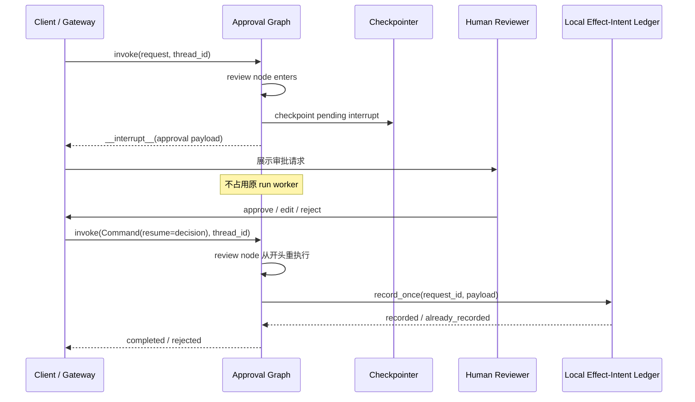
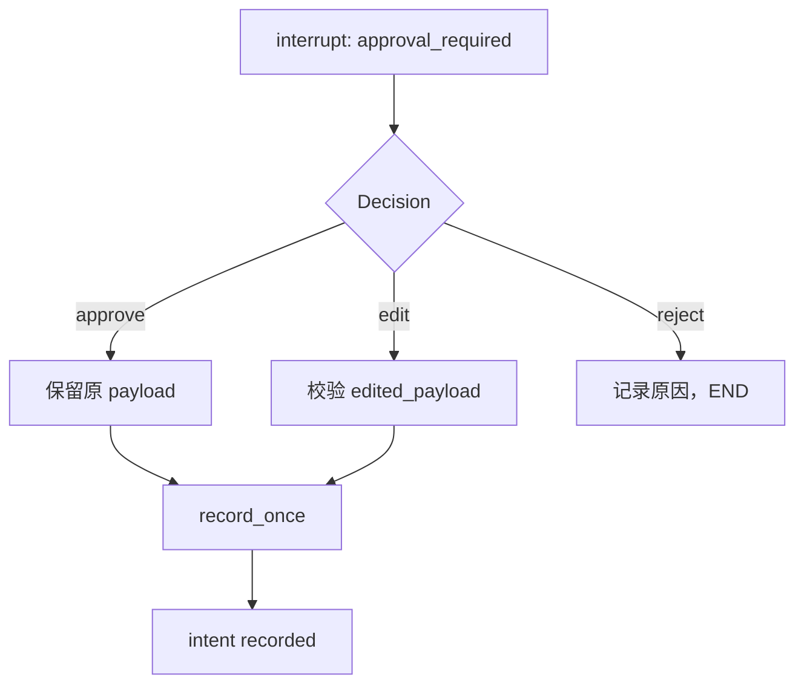

# 第 10 章：Human-in-the-loop——Interrupt、恢复、Time Travel 与副作用安全

> **课程位置**：Graph 编排层第 4 章  
> **锁定环境**：Python 3.12 / LangGraph 1.2.x / SQLite checkpointer 3.x  
> **API 校准日期**：2026-07-13  
> **本章工件**：`create_approval_workflow()` 与 `SqliteEffectLedger`

## 1. 系统快照：任务能够恢复，发布前却没有人工控制点

第 09 章让研究 Graph 跨进程恢复。当前流程生成草稿后会直接执行发布；真实业务需要负责人检查来源、修改内容或拒绝交付。

服务器不能用 `input()` 占住 worker 等待审批。`interrupt(value)` 产生可持久化中断，当前 run 返回控制权；数分钟或数天后，新请求再用 `Command(resume=...)` 恢复同一 thread。

<!-- diagram:id=10-durable-hitl-sequence -->


**图的文本替代**：客户端启动 Graph，review 节点产生 interrupt 并由 Checkpointer 保存；run 返回，不占用 worker。审批者稍后提交决定，客户端用相同 thread_id 和 `Command(resume)` 恢复。

Review 节点会从头重执行，最终把本地 effect intent 按 operation ID 记录一次。真正远端投递仍需 provider idempotency key 或 outbox。

## 2. `interrupt()` 的五条关键规则

1. 必须配置 checkpointer，并使用稳定 `thread_id`；
2. resume 时包含 interrupt 的**整个节点从开头重执行**；
3. 不要用 broad `try/except` 吞掉 GraphInterrupt；
4. 多个 interrupt 按节点中的调用顺序匹配，顺序必须稳定；
5. interrupt 前的外部副作用可能重复，必须移到其后或做幂等。

静态 `interrupt_before=["tools"]` 适合调试或统一断点；动态 `interrupt({...})` 能携带业务审批载荷并根据 State 决定何时暂停，是生产 HITL 主线。

## 3. 一个可恢复的 approve 流程

事实源：

- `mini_deerflow.graph.approval` 的 `tutorial:10-dynamic-approval-workflow`；
- `mini_deerflow.persistence` 的 `tutorial:10-idempotent-effect-ledger`。

下面关闭第一条 SQLite 连接后，用新的 saver 和 compiled graph 恢复，证明暂停不是依赖原 Python 调用栈。

```python sync=ch10-approve-restart
from pathlib import Path
import tempfile
from langgraph.checkpoint.sqlite import SqliteSaver
from langgraph.types import Command
from mini_deerflow.graph import create_approval_workflow
from mini_deerflow.persistence import SqliteEffectLedger

with tempfile.TemporaryDirectory() as approval_directory:
    approval_root = Path(approval_directory)
    approval_checkpoint_path = approval_root / "checkpoints.sqlite"
    approval_effects = SqliteEffectLedger(approval_root / "effects.sqlite")
    approval_config = {"configurable": {"thread_id": "publish-001"}}
    approval_request = {
        "request_id": "publish-001",
        "action": "publish_report",
        "payload": {"path": "reports/final.md"},
        "review_stages": ["risk"],
    }

    with SqliteSaver.from_conn_string(str(approval_checkpoint_path)) as saver:
        approval_graph = create_approval_workflow(
            checkpointer=saver,
            effect_ledger=approval_effects,
        )
        paused_approval = approval_graph.invoke(
            approval_request,
            config=approval_config,
        )
        assert paused_approval["__interrupt__"][0].value["stage"] == "risk"
        assert approval_graph.get_state(approval_config).next == ("review",)

    with SqliteSaver.from_conn_string(str(approval_checkpoint_path)) as reopened_saver:
        restarted_approval_graph = create_approval_workflow(
            checkpointer=reopened_saver,
            effect_ledger=approval_effects,
        )
        approved_result = restarted_approval_graph.invoke(
            Command(resume={"decision": "approve"}),
            config=approval_config,
        )

    assert approved_result["status"] == "completed"
    assert approved_result["effect_status"] == "recorded"
    assert approval_effects.count("publish-001") == 1
```

## 4. approve、edit、reject 是三种业务命令

resume payload 来自外部客户端，仍需验证。`ApprovalDecision` 用 Pydantic 将 decision 限制为三种，并要求 edit 必须包含 `edited_payload`。

<!-- diagram:id=10-approval-decision-tree -->


**图的文本替代**：approve 保留原 payload，edit 先校验并替换 payload，二者把本地 effect intent 按 operation ID 记录一次；reject 记录理由并结束，不创建 intent。远端投递不在这张图里，必须另用 provider idempotency key 或 outbox。

```python sync=ch10-edit-reject
from langgraph.checkpoint.memory import InMemorySaver

with tempfile.TemporaryDirectory() as decision_directory:
    decision_effects = SqliteEffectLedger(Path(decision_directory) / "effects.sqlite")
    decision_graph = create_approval_workflow(
        checkpointer=InMemorySaver(),
        effect_ledger=decision_effects,
    )

    edit_config = {"configurable": {"thread_id": "edit-001"}}
    decision_graph.invoke(
        {
            "request_id": "edit-001",
            "action": "publish_report",
            "payload": {"path": "reports/draft.md"},
        },
        config=edit_config,
    )
    edited_result = decision_graph.invoke(
        Command(
            resume={
                "decision": "edit",
                "edited_payload": {"path": "reports/reviewed.md"},
            }
        ),
        config=edit_config,
    )
    assert edited_result["payload"] == {"path": "reports/reviewed.md"}
    assert decision_effects.count("edit-001") == 1

    reject_config = {"configurable": {"thread_id": "reject-001"}}
    decision_graph.invoke(
        {
            "request_id": "reject-001",
            "action": "publish_report",
            "payload": {"path": "reports/unsafe.md"},
        },
        config=reject_config,
    )
    rejected_result = decision_graph.invoke(
        Command(resume={"decision": "reject", "reason": "证据不足"}),
        config=reject_config,
    )
    assert rejected_result["status"] == "rejected"
    assert decision_effects.count("reject-001") == 0
```

“edit”不是直接 `update_state()` 后无条件继续。审批 API 应校验允许修改的字段、重新计算风险，并保留原提案和编辑后的审计记录。

## 5. 多个 interrupt 与稳定顺序

同一个 review 节点可依次请求 risk 与 compliance 审批。第一次 resume 后，节点从开头执行：第一个 `interrupt()` 取得已保存的 risk 决定，随后第二个 interrupt 暂停。再次 resume 时两个调用按相同顺序匹配。

```python sync=ch10-multiple-interrupt-events
with tempfile.TemporaryDirectory() as multi_directory:
    multi_effects = SqliteEffectLedger(Path(multi_directory) / "effects.sqlite")
    multi_graph = create_approval_workflow(
        checkpointer=InMemorySaver(),
        effect_ledger=multi_effects,
    )
    multi_config = {"configurable": {"thread_id": "multi-001"}}
    multi_request = {
        "request_id": "multi-001",
        "action": "publish_report",
        "payload": {"path": "reports/final.md"},
        "review_stages": ["risk", "compliance"],
    }

    first_entry_events = list(
        multi_graph.stream(multi_request, config=multi_config, stream_mode="custom")
    )
    first_stage = multi_graph.get_state(multi_config).tasks[0].interrupts[0].value["stage"]
    second_entry_events = list(
        multi_graph.stream(
            Command(resume={"decision": "approve"}),
            config=multi_config,
            stream_mode="custom",
        )
    )
    second_stage = multi_graph.get_state(multi_config).tasks[0].interrupts[0].value["stage"]
    final_entry_events = list(
        multi_graph.stream(
            Command(resume={"decision": "approve"}),
            config=multi_config,
            stream_mode="custom",
        )
    )

    assert (first_stage, second_stage) == ("risk", "compliance")
    assert [
        first_entry_events[0]["event"],
        second_entry_events[0]["event"],
        final_entry_events[0]["event"],
    ] == ["review_node_entered"] * 3
    assert multi_graph.get_state(multi_config).values["status"] == "completed"
```

三个 `review_node_entered` 事件证明节点初次运行和两次 resume 都从头进入。不要根据可变 State 条件改变 interrupt 的数量或顺序；这会让历史 resume value 与新调用错配。复杂并行审批可以使用 interrupt ID→resume value map，但仍需稳定的业务 request ID。

## 6. 失败实验：interrupt 前的副作用会重复

下面故意把外部写入放在 interrupt 前。列表代表邮件/扣款等不可由 checkpoint 回滚的外部系统：

```python sync=ch10-side-effect-before-interrupt-failure
from typing import TypedDict
from langgraph.graph import START, END, StateGraph
from langgraph.types import interrupt

class UnsafeApprovalState(TypedDict):
    request_id: str

unsafe_effects: list[str] = []

def unsafe_review(state: UnsafeApprovalState) -> dict[str, str]:
    unsafe_effects.append(state["request_id"])
    interrupt({"request_id": state["request_id"]})
    return {}

unsafe_builder = StateGraph(UnsafeApprovalState)
unsafe_builder.add_node("review", unsafe_review)
unsafe_builder.add_edge(START, "review")
unsafe_builder.add_edge("review", END)
unsafe_graph = unsafe_builder.compile(checkpointer=InMemorySaver())
unsafe_config = {"configurable": {"thread_id": "unsafe-001"}}

unsafe_graph.invoke({"request_id": "unsafe-001"}, config=unsafe_config)
unsafe_graph.invoke(Command(resume="approve"), config=unsafe_config)

assert unsafe_effects == ["unsafe-001", "unsafe-001"]
```

修复有两种：把副作用移动到所有 interrupt 之后的独立节点；或者让外部 API 以稳定业务 ID 幂等执行。本地实验把 effect intent 记录放在 interrupt 后；真正远端调用仍须选择支持 idempotency key 的 provider，或使用事务 outbox。

## 7. Time Travel 会重放 effect-intent 节点

从 `next == ("record_effect_intent",)` 的 checkpoint 重放，会再次调用记录节点。SQLite ledger 以 `request_id` 为 idempotency key，第二次返回 `already_recorded`，数据库仍只有一行。

这只证明本地记录幂等，不宣称任意远端发布 exactly-once。远端系统必须接受同一 idempotency key，或由事务 outbox 负责投递。

```python sync=ch10-time-travel-idempotency
with tempfile.TemporaryDirectory() as replay_directory:
    replay_effects = SqliteEffectLedger(Path(replay_directory) / "effects.sqlite")
    replay_graph = create_approval_workflow(
        checkpointer=InMemorySaver(),
        effect_ledger=replay_effects,
    )
    replay_config = {"configurable": {"thread_id": "replay-001"}}
    replay_graph.invoke(
        {
            "request_id": "replay-001",
            "action": "publish_report",
            "payload": {"path": "reports/final.md"},
        },
        config=replay_config,
    )
    replay_graph.invoke(
        Command(resume={"decision": "approve"}),
        config=replay_config,
    )
    before_effect = next(
        snapshot
        for snapshot in replay_graph.get_state_history(replay_config)
        if snapshot.next == ("record_effect_intent",)
    )

    replayed_result = replay_graph.invoke(None, config=before_effect.config)

    assert replayed_result["effect_status"] == "already_recorded"
    assert replay_effects.count("replay-001") == 1
```

### 7.1 两个连接并发争抢同一个 key

顺序重放不能证明并发安全。ledger 在事务内使用 `BEGIN IMMEDIATE` 串行化本地 SQLite 的 check/insert 临界区，主键仍是最终防线：

```python sync=ch10-concurrent-intent
from concurrent.futures import ThreadPoolExecutor
import threading

with tempfile.TemporaryDirectory() as concurrent_directory:
    concurrent_path = Path(concurrent_directory) / "effects.sqlite"
    concurrent_ledgers = [
        SqliteEffectLedger(concurrent_path),
        SqliteEffectLedger(concurrent_path),
    ]
    concurrent_barrier = threading.Barrier(2)

    def record_concurrently(ledger: SqliteEffectLedger) -> str:
        concurrent_barrier.wait()
        return ledger.record_once(
            "concurrent-001",
            "publish_report",
            {"path": "reports/final.md"},
        ).status

    with ThreadPoolExecutor(max_workers=2) as executor:
        concurrent_statuses = list(
            executor.map(record_concurrently, concurrent_ledgers)
        )

    assert sorted(concurrent_statuses) == ["already_recorded", "recorded"]
    assert concurrent_ledgers[0].count("concurrent-001") == 1
```

这仍只覆盖单个 SQLite 文件的本地事务。跨数据库或远端 API 的 exactly-once 不能由这个锁推导。

### 7.2 Idempotency key 冲突必须失败

相同 key 如果对应不同 action/payload，不能悄悄返回第一次结果，否则调用方会误以为新操作成功。

```python sync=ch10-idempotency-conflict-failure
from mini_deerflow.persistence import IdempotencyConflictError

with tempfile.TemporaryDirectory() as conflict_directory:
    conflict_ledger = SqliteEffectLedger(Path(conflict_directory) / "effects.sqlite")
    conflict_ledger.record_once(
        "operation-001",
        "publish_report",
        {"path": "reports/final.md"},
    )
    try:
        conflict_ledger.record_once(
            "operation-001",
            "delete_report",
            {"path": "reports/final.md"},
        )
    except IdempotencyConflictError as error:
        conflict_error = error
    else:
        raise AssertionError("相同 idempotency key 的不同副作用必须失败")

assert "不同副作用" in str(conflict_error)
```

真实系统常使用数据库唯一约束、事务 outbox、供应商 idempotency key 或 compare-and-set。仅在进程内用 `set()` 不能跨重启，也不能在多个 worker 间协调。

## 8. HITL API 的安全边界

Graph 能暂停和恢复，不等于审批系统已经安全。Gateway 还必须验证：

- 当前用户是否能读取该 thread 和 interrupt payload；
- 是否拥有对应 stage 的审批角色；
- resume 是否针对仍待处理的 interrupt，而不是旧页面重放；
- edit 允许修改哪些字段，修改后是否需要重新审批；
- 审批人不能审批自己的高风险请求（如业务要求四眼原则）；
- 原始提案、决定、reason、时间和调用方身份是否进入不可抵赖审计。

不要把 auth token 放入 interrupt value 或 State；interrupt value 会进入 checkpoint、API 响应和可能的 trace。

## 9. DeerFlow 对照阅读

当前 DeerFlow 的 Gateway/RunManager 负责 thread/run 生命周期、cancel/rollback、SSE 和恢复；Graph checkpointer 负责 State lineage。阅读固定提交 `2bd0f56a0f5a418d126cb4a18e23001f54ccf024`：

| 本章概念 | DeerFlow 阅读入口 |
|---|---|
| thread + checkpoint | `runtime/checkpointer` 与 `thread_state.py` |
| run 状态 interrupted/completed | Gateway RunManager / run repository |
| rollback / cancel | `app/gateway/routers/thread_runs.py` |
| pre-run checkpoint | `runtime/runs/worker.py` |
| 高风险工具边界 | tool policy、middleware 与 sandbox adapters |

DeerFlow 的产品级 rollback 还涉及 run event、retained stream 与 thread status，不能只调用 `graph.invoke(None, old_config)` 就宣称完整实现。

## 10. 练习与验收

### 练习 A

新增 `legal` 第三审批阶段，并用 custom stream 证明 review 节点进入四次（初次 + 三次 resume）。

### 练习 B

解释为什么 `interrupt_before=["tools"]` 不能取代携带业务载荷的动态 interrupt。

### 练习 C

把 `SqliteEffectLedger` 扩展为事务 outbox：Graph 节点只写 outbox，独立 worker 发送，发送结果按 operation_id 回写。列出 crash 发生在各步骤时的恢复策略。

### 延迟回忆题

合上讲义回答：resume 从节点哪里开始？为什么 interrupt 前不能发送邮件？time travel 后数据库为何不会自动回滚？

```bash
TMPDIR="$PWD/.tmp" uv run --locked --group dev pytest -q \
  tests/test_mini_deerflow_persistence_hitl.py
```

## 11. 资料

资料访问日期：2026-07-13。

- [LangGraph Interrupts](https://docs.langchain.com/oss/python/langgraph/interrupts)
- [LangGraph Persistence](https://docs.langchain.com/oss/python/langgraph/persistence)
- [LangGraph Time Travel](https://docs.langchain.com/oss/python/langgraph/use-time-travel)
- [LangGraph `interrupt` Reference](https://reference.langchain.com/python/langgraph/types/interrupt)
- [DeerFlow Run Worker](https://github.com/bytedance/deer-flow/blob/main/backend/packages/harness/deerflow/runtime/runs/worker.py)

## 本章交付：流程可恢复、可审批，单个 Agent 的上下文开始失控

本章交付 durable interrupt、approve/edit/reject 和本地 effect-intent ledger。Mini DeerFlow 会先持久化草稿再暂停发布；拒绝不产生正式 Artifact，重放同一 request 只保留一条 intent。

第三部至此完成。随着研究轮次、工具结果和草稿不断增长，Lead Agent 的上下文开始膨胀。第 11 章会把独立研究任务委派给受控 Subagent，同时保留 Lead 的最终控制权。

继续阅读：[第 11 章：用 Subagent 隔离任务与上下文](./11_Multi_Agent_Patterns.md)。
