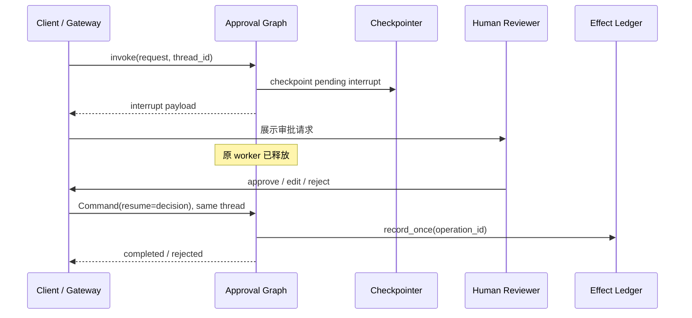

# 第 10 章：审批等三天，Graph 不必占着 worker

<!-- lesson-contract:v2 -->

> **课程位置**：Graph 编排层第 4 章
> **锁定环境**：Python 3.12 / LangGraph 1.2.x / SQLite checkpointer 3.x
> **本章工件**：interrupt、Command(resume)、审批协议、重放边界与幂等 effect ledger

> [!NOTE]
> **本章只解决一个问题**：怎样让 Graph 释放 worker、等待人工审批，并在以后从原位置恢复。
>
> **当前系统**：研究任务已经可以跨进程恢复执行现场。
>
> **遇到的问题**：报告会直接发布；若简单阻塞线程，又无法等待数小时或数天。
>
> **本章目标**：用 Interrupt、`Command(resume=...)` 和稳定 operation ID 实现持久审批与幂等副作用。
>
> **暂时不讲**：多 Agent 委派、产品 Runtime 和 SSE 重连。
>
> **学完以后**：你能解释 Interrupt 为什么不是线程睡眠，以及节点重入为何要求副作用幂等。
>
> **预计时间**：35～45 分钟。

## 1. 报告恢复了，却会绕过负责人直接发布

第 09 章保住了研究任务的执行现场。进程重建后，Graph 可以继续生成报告，但它随后会直接发布。真实业务通常要等负责人批准、编辑或拒绝。

这个决定可能几分钟后到，也可能拖上三天。服务器不能让原 worker 一直停在 `input()`、`Event.wait` 或 HTTP 请求里。它应保存现场，结束当前 Run，再由后来的请求恢复。



**图的文本替代**：Graph 把 interrupt 写进 checkpoint 后返回控制权。人工决定通过新请求和同一 thread 恢复；审批通过后，副作用意图使用稳定 operation ID 记录。

## 2. 一个等待审批的任务堵住了后续请求

`input()` 在 Notebook 里很直观，放进服务端却会占用线程、连接或协程。等待越久，资源问题越明显；一旦部署或崩溃，原调用栈还会消失。

<!-- lesson-lab:id=ch10-blocking-wait-failure layer=concept kind=failure concept=durable-approval pair=release-worker -->
### 一个审批等待让后续任务无法开始

**运行前先预测**：线程池只有一个 worker，第一个任务等待 Event 时，第二个任务能否完成？

```python sync=ch10-blocking-wait-failure
from concurrent.futures import ThreadPoolExecutor, TimeoutError
from threading import Event


approval_arrived = Event()
waiting_started = Event()


def blocking_approval() -> str:
    waiting_started.set()
    approval_arrived.wait()
    return "approved"


with ThreadPoolExecutor(max_workers=1) as executor:
    waiting = executor.submit(blocking_approval)
    waiting_started.wait(timeout=1)
    unrelated = executor.submit(lambda: "unrelated-completed")
    try:
        unrelated.result(timeout=0.05)
    except TimeoutError:
        second_task_blocked = True
    else:
        second_task_blocked = False
    approval_arrived.set()
    approval_result = waiting.result(timeout=1)
    unrelated_result = unrelated.result(timeout=1)

print("second_task_blocked =", second_task_blocked)
print("approval_result =", approval_result)
print("unrelated_result =", unrelated_result)
print("worker_held_while_waiting =", True)
```

**观察结果**：

```text output=ch10-blocking-wait-failure
second_task_blocked = True
approval_result = approved
unrelated_result = unrelated-completed
worker_held_while_waiting = True
```

**发生了什么**：审批期间没有任何计算，任务却一直占着 worker。增加线程只能晚一点耗尽容量，也不能让这段等待跨部署恢复。

**动手修改**：把线程数改为 2，再提交三个等待任务。说明容量扩张为什么没有改变资源与恢复模型。
<!-- /lesson-lab -->

<!-- lesson-lab:id=ch10-durable-interrupt-repair layer=concept kind=repair concept=durable-approval pair=release-worker -->
### interrupt 保存暂停点并立即返回

**运行前先预测**：第一次 invoke 会返回 completed，还是携带 `__interrupt__`？snapshot.next 指向哪个节点？

```python sync=ch10-durable-interrupt-repair
from typing import TypedDict

from langgraph.checkpoint.memory import InMemorySaver
from langgraph.graph import END, START, StateGraph
from langgraph.types import Command, interrupt


class ApprovalState(TypedDict, total=False):
    request_id: str
    status: str


def review(state: ApprovalState) -> dict[str, str]:
    decision = interrupt(
        {"request_id": state["request_id"], "question": "是否批准发布？"}
    )
    return {"status": "completed" if decision == "approve" else "rejected"}


builder = StateGraph(ApprovalState)
builder.add_node("review", review)
builder.add_edge(START, "review")
builder.add_edge("review", END)
graph = builder.compile(checkpointer=InMemorySaver())
config = {"configurable": {"thread_id": "approval-001"}}
paused = graph.invoke({"request_id": "approval-001"}, config=config)
snapshot = graph.get_state(config)
resumed = graph.invoke(Command(resume="approve"), config=config)

print("interrupt_count =", len(paused["__interrupt__"]))
print("interrupt_value =", paused["__interrupt__"][0].value)
print("paused_next =", snapshot.next)
print("resumed_status =", resumed["status"])
```

**观察结果**：

```text output=ch10-durable-interrupt-repair
interrupt_count = 1
interrupt_value = {'request_id': 'approval-001', 'question': '是否批准发布？'}
paused_next = ('review',)
resumed_status = completed
```

**发生了什么**：`interrupt(value)` 把待审批内容写进 checkpoint，然后让当前调用返回。稍后的 `Command(resume=...)` 使用同一 thread，把人工决定交还给这次 interrupt。

恢复时，包含 interrupt 的节点会从开头重新执行。不要用宽泛的 `try/except` 吞掉 `GraphInterrupt`，resume 也必须使用原来的 thread ID。

**动手修改**：用新 thread ID 调用 resume。记录框架如何拒绝没有匹配 interrupt 的恢复请求。
<!-- /lesson-lab -->

## 3. “批准”也是一份不可信的外部输入

API 收到的人工决定只是一段外部数据。`approve`、`edit`、`reject` 需要结构化协议；`edit` 还要明确哪些字段可以改。

<!-- lesson-lab:id=ch10-approval-decision-protocol layer=concept kind=baseline concept=approval-decision -->
### 用 Pydantic 验证 approve、edit 与 reject

**运行前先预测**：decision 为 edit 却缺少 edited_payload 时，协议会在 Graph 路由前还是发布后失败？

```python sync=ch10-approval-decision-protocol
from typing import Literal

from pydantic import BaseModel, Field, ValidationError, model_validator


class ApprovalDecision(BaseModel):
    decision: Literal["approve", "edit", "reject"]
    edited_payload: dict[str, str] | None = None
    reason: str = ""

    @model_validator(mode="after")
    def edit_requires_payload(self):
        if self.decision == "edit" and not self.edited_payload:
            raise ValueError("edit 必须包含 edited_payload")
        return self


approve = ApprovalDecision(decision="approve")
edit = ApprovalDecision(
    decision="edit",
    edited_payload={"path": "reports/reviewed.md"},
)
reject = ApprovalDecision(decision="reject", reason="证据不足")
try:
    ApprovalDecision(decision="edit")
except ValidationError as error:
    invalid_edit_error = error.errors()[0]["type"]
else:
    invalid_edit_error = "none"

print("decisions =", [approve.decision, edit.decision, reject.decision])
print("edited_path =", edit.edited_payload["path"])
print("reject_reason =", reject.reason)
print("invalid_edit_error =", invalid_edit_error)
```

**观察结果**：

```text output=ch10-approval-decision-protocol
decisions = ['approve', 'edit', 'reject']
edited_path = reports/reviewed.md
reject_reason = 证据不足
invalid_edit_error = value_error
```

**发生了什么**：决定在进入业务路由前完成结构与跨字段校验。Schema 合法只说明数据形状正确；Gateway 还要检查 thread owner、审批角色和四眼原则。

**动手修改**：让 edit 只能改 path，不能改 request_id 或 action。明确允许字段，而不是接受任意 dict 后再删除危险 key。
<!-- /lesson-lab -->

## 4. 暂停前发出的邮件，在恢复时又发了一遍

节点恢复时从头执行。若日志、邮件、扣款或文件写入放在 interrupt 前，它们会再次发生。Checkpoint 只能恢复 Graph，不能回滚外部世界。

<!-- lesson-lab:id=ch10-effect-before-interrupt-failure layer=concept kind=failure concept=interrupt-side-effect pair=effect-order -->
### Resume 让外部 append 执行两次

**运行前先预测**：初次暂停前 append 一次，resume 重入节点后列表长度是多少？

```python sync=ch10-effect-before-interrupt-failure
from typing import TypedDict

from langgraph.checkpoint.memory import InMemorySaver
from langgraph.graph import END, START, StateGraph
from langgraph.types import Command, interrupt


class UnsafeState(TypedDict):
    request_id: str


external_effects: list[str] = []


def unsafe_review(state: UnsafeState) -> dict[str, object]:
    external_effects.append(state["request_id"])
    interrupt({"request_id": state["request_id"]})
    return {}


builder = StateGraph(UnsafeState)
builder.add_node("review", unsafe_review)
builder.add_edge(START, "review")
builder.add_edge("review", END)
graph = builder.compile(checkpointer=InMemorySaver())
config = {"configurable": {"thread_id": "unsafe-001"}}
graph.invoke({"request_id": "unsafe-001"}, config=config)
graph.invoke(Command(resume="approve"), config=config)

print("external_effects =", external_effects)
print("effect_count =", len(external_effects))
print("same_request_repeated =", len(set(external_effects)) == 1)
```

**观察结果**：

```text output=ch10-effect-before-interrupt-failure
external_effects = ['unsafe-001', 'unsafe-001']
effect_count = 2
same_request_repeated = True
```

**发生了什么**：Graph 正确恢复了 review，外部列表却多写了一次。interrupt 没有出错，真正的问题是副作用发生在暂停之前。

**动手修改**：在 append 前检查 State 中的布尔值。思考 crash 发生在 append 后、State checkpoint 前时，这个布尔值为什么仍不可靠。
<!-- /lesson-lab -->

<!-- lesson-lab:id=ch10-effect-after-interrupt-repair layer=concept kind=repair concept=interrupt-side-effect pair=effect-order -->
### 把副作用移到审批后的独立节点

**运行前先预测**：review resume 会重入，但 publish 节点在批准后只执行几次？

```python sync=ch10-effect-after-interrupt-repair
from typing import Literal, TypedDict

from langgraph.checkpoint.memory import InMemorySaver
from langgraph.graph import END, START, StateGraph
from langgraph.types import Command, interrupt


class SafeState(TypedDict, total=False):
    request_id: str
    status: str


external_effects: list[str] = []


def review(state: SafeState) -> Command[Literal["publish", "reject"]]:
    decision = interrupt({"request_id": state["request_id"]})
    return Command(goto="publish" if decision == "approve" else "reject")


def publish(state: SafeState) -> dict[str, str]:
    external_effects.append(state["request_id"])
    return {"status": "completed"}


builder = StateGraph(SafeState)
builder.add_node("review", review)
builder.add_node("publish", publish)
builder.add_node("reject", lambda state: {"status": "rejected"})
builder.add_edge(START, "review")
builder.add_edge("publish", END)
builder.add_edge("reject", END)
graph = builder.compile(checkpointer=InMemorySaver())
config = {"configurable": {"thread_id": "safe-001"}}
graph.invoke({"request_id": "safe-001"}, config=config)
result = graph.invoke(Command(resume="approve"), config=config)

print("status =", result["status"])
print("external_effects =", external_effects)
print("effect_count =", len(external_effects))
```

**观察结果**：

```text output=ch10-effect-after-interrupt-repair
status = completed
external_effects = ['safe-001']
effect_count = 1
```

**发生了什么**：review 可以安全重入，publish 只在批准路径上运行。顺序问题解决了，但 publish 自身仍可能因失败恢复或 time travel 被重放，所以还需要幂等键。

**动手修改**：reject 后确认 external_effects 为空。再解释为什么 approve 请求重复提交需要 Gateway 冲突检查。
<!-- /lesson-lab -->

## 5. 从旧快照重放，报告发布了第二次

第 09 章已经用 time travel 从历史 `next` 建立新分支。若选中的 checkpoint 位于 publish 前，重放自然会再次进入发布节点。

<!-- lesson-lab:id=ch10-time-travel-duplicate-failure layer=concept kind=failure concept=idempotent-effect pair=stable-operation-id -->
### 从 publish 前 checkpoint 重放出第二条记录

**运行前先预测**：首次 approve 已 append 一次，再从 `next == ('publish',)` 重放，列表长度是多少？

```python sync=ch10-time-travel-duplicate-failure
from typing import Literal, TypedDict

from langgraph.checkpoint.memory import InMemorySaver
from langgraph.graph import END, START, StateGraph
from langgraph.types import Command, interrupt


class EffectState(TypedDict, total=False):
    operation_id: str
    status: str


effects: list[str] = []


def review(state: EffectState) -> Command[Literal["publish"]]:
    interrupt({"operation_id": state["operation_id"]})
    return Command(goto="publish")


def publish(state: EffectState) -> dict[str, str]:
    effects.append(state["operation_id"])
    return {"status": "completed"}


builder = StateGraph(EffectState)
builder.add_node("review", review)
builder.add_node("publish", publish)
builder.add_edge(START, "review")
builder.add_edge("publish", END)
graph = builder.compile(checkpointer=InMemorySaver())
config = {"configurable": {"thread_id": "replay-001"}}
graph.invoke({"operation_id": "publish-001"}, config=config)
graph.invoke(Command(resume="approve"), config=config)
before_publish = next(
    snapshot
    for snapshot in graph.get_state_history(config)
    if snapshot.next == ("publish",)
)
graph.invoke(None, config=before_publish.config)

print("effects =", effects)
print("effect_count =", len(effects))
print("unique_operation_ids =", len(set(effects)))
```

**观察结果**：

```text output=ch10-time-travel-duplicate-failure
effects = ['publish-001', 'publish-001']
effect_count = 2
unique_operation_ids = 1
```

**发生了什么**：Checkpoint 准确地重放了节点，外部列表却不认识“同一次发布”。Graph 的 checkpoint 无法自动给外部系统提供 exactly-once 语义。

**动手修改**：每次重试生成新的随机 operation ID。说明这为何彻底破坏去重能力。
<!-- /lesson-lab -->

<!-- lesson-lab:id=ch10-idempotent-effect-repair layer=concept kind=repair concept=idempotent-effect pair=stable-operation-id -->
### 用稳定 operation ID 让重放返回 already_recorded

**运行前先预测**：记录函数第二次收到相同 ID 和 payload 时，应插入新记录还是返回已有结果？

```python sync=ch10-idempotent-effect-repair
from typing import Literal, TypedDict

from langgraph.checkpoint.memory import InMemorySaver
from langgraph.graph import END, START, StateGraph
from langgraph.types import Command, interrupt


class EffectState(TypedDict, total=False):
    operation_id: str
    status: str
    effect_status: str


ledger: dict[str, str] = {}


def record_once(operation_id: str, payload: str) -> str:
    if operation_id in ledger:
        if ledger[operation_id] != payload:
            raise ValueError("operation ID 已用于不同 payload")
        return "already_recorded"
    ledger[operation_id] = payload
    return "recorded"


def review(state: EffectState) -> Command[Literal["publish"]]:
    interrupt({"operation_id": state["operation_id"]})
    return Command(goto="publish")


def publish(state: EffectState) -> dict[str, str]:
    effect_status = record_once(state["operation_id"], "reports/final.md")
    return {"status": "completed", "effect_status": effect_status}


builder = StateGraph(EffectState)
builder.add_node("review", review)
builder.add_node("publish", publish)
builder.add_edge(START, "review")
builder.add_edge("publish", END)
graph = builder.compile(checkpointer=InMemorySaver())
config = {"configurable": {"thread_id": "idempotent-001"}}
graph.invoke({"operation_id": "publish-001"}, config=config)
graph.invoke(Command(resume="approve"), config=config)
before_publish = next(
    snapshot
    for snapshot in graph.get_state_history(config)
    if snapshot.next == ("publish",)
)
replayed = graph.invoke(None, config=before_publish.config)

print("replayed_effect_status =", replayed["effect_status"])
print("ledger_count =", len(ledger))
print("stored_payload =", ledger["publish-001"])
```

**观察结果**：

```text output=ch10-idempotent-effect-repair
replayed_effect_status = already_recorded
ledger_count = 1
stored_payload = reports/final.md
```

**发生了什么**：稳定的 operation ID 把两次节点执行映射到同一个业务意图。相同 key、相同 payload 可以重放；相同 key、不同 payload 必须冲突。

内存字典只够解释语义，不能协调多个进程。后面的工程迁移会改用 SQLite 事务；真正调用远端服务时，还需要 provider idempotency key 或 outbox。

**动手修改**：第二次使用相同 ID 和不同 path。确认 fail closed，并记录冲突需要怎样审计。
<!-- /lesson-lab -->

## 6. 两级审批为什么不能随意交换顺序

同一节点可以依次请求 risk、compliance 等审批。每次 resume 都从节点开头重入，框架按 interrupt 的调用顺序匹配已经保存的 resume value。

<!-- lesson-lab:id=ch10-multiple-interrupt-order layer=concept kind=baseline concept=interrupt-order -->
### 两次 Resume 三次进入同一节点

**运行前先预测**：两个审批阶段需要初次运行加几次 resume？review 节点总共进入几次？

```python sync=ch10-multiple-interrupt-order
from typing import TypedDict

from langgraph.checkpoint.memory import InMemorySaver
from langgraph.graph import END, START, StateGraph
from langgraph.types import Command, interrupt


class MultiState(TypedDict, total=False):
    stages: list[str]
    status: str


entries: list[str] = []


def review(state: MultiState) -> dict[str, str]:
    entries.append("review_node_entered")
    for stage in state["stages"]:
        interrupt({"stage": stage})
    return {"status": "completed"}


builder = StateGraph(MultiState)
builder.add_node("review", review)
builder.add_edge(START, "review")
builder.add_edge("review", END)
graph = builder.compile(checkpointer=InMemorySaver())
config = {"configurable": {"thread_id": "multi-001"}}
graph.invoke({"stages": ["risk", "compliance"]}, config=config)
first_stage = graph.get_state(config).tasks[0].interrupts[0].value["stage"]
graph.invoke(Command(resume="approve"), config=config)
second_stage = graph.get_state(config).tasks[0].interrupts[0].value["stage"]
result = graph.invoke(Command(resume="approve"), config=config)

print("stages =", [first_stage, second_stage])
print("node_entry_count =", len(entries))
print("status =", result["status"])
```

**观察结果**：

```text output=ch10-multiple-interrupt-order
stages = ['risk', 'compliance']
node_entry_count = 3
status = completed
```

**发生了什么**：第一次 resume 重放第一个决定，并在第二个 interrupt 处暂停；第二次 resume 才完成。若版本升级后改变调用数量或顺序，历史值就可能匹配到错误阶段。

**动手修改**：根据可变 State 交换 stages 顺序，观察为什么恢复协议必须冻结业务 request ID 与调用次序。
<!-- /lesson-lab -->

## 7. 把可恢复审批接回 Mini DeerFlow

### 7.1 关闭 SQLite 后恢复审批

<!-- lesson-lab:id=ch10-mini-deerflow-approve-restart layer=migration kind=contrast concept=durable-approval -->
### 新 Graph 实例继续同一 interrupt

**运行前先预测**：暂停后关闭 saver，重开时 effect ledger 是否已有记录？批准后有几行？

```python sync=ch10-mini-deerflow-approve-restart
from pathlib import Path
import tempfile

from langgraph.types import Command

from mini_deerflow.graph import create_approval_workflow
from mini_deerflow.persistence import (
    SqliteEffectLedger,
    open_sqlite_checkpointer,
)


with tempfile.TemporaryDirectory() as directory:
    root = Path(directory)
    checkpoint_path = root / "checkpoints.sqlite"
    effects = SqliteEffectLedger(root / "effects.sqlite")
    config = {"configurable": {"thread_id": "publish-001"}}
    request = {
        "request_id": "publish-001",
        "action": "publish_report",
        "payload": {"path": "reports/final.md"},
        "review_stages": ["risk"],
    }
    with open_sqlite_checkpointer(checkpoint_path) as saver:
        graph = create_approval_workflow(
            checkpointer=saver,
            effect_ledger=effects,
        )
        paused = graph.invoke(request, config=config)
        paused_next = graph.get_state(config).next
        count_while_paused = effects.count("publish-001")

    with open_sqlite_checkpointer(checkpoint_path) as saver:
        restarted = create_approval_workflow(
            checkpointer=saver,
            effect_ledger=effects,
        )
        result = restarted.invoke(
            Command(resume={"decision": "approve"}),
            config=config,
        )
        final_effect_count = effects.count("publish-001")

print("paused_stage =", paused["__interrupt__"][0].value["stage"])
print("paused_next =", paused_next)
print("count_while_paused =", count_while_paused)
print("final_status =", result["status"])
print("effect_count =", final_effect_count)
```

**观察结果**：

```text output=ch10-mini-deerflow-approve-restart
paused_stage = risk
paused_next = ('review',)
count_while_paused = 0
final_status = completed
effect_count = 1
```

**发生了什么**：旧 saver 和 Graph 都已关闭，审批仍能从 SQLite 恢复。原 worker 早已结束，effect intent 只在批准之后写入。
<!-- /lesson-lab -->

### 7.2 Edit 与 reject 走不同业务终态

<!-- lesson-lab:id=ch10-mini-deerflow-edit-reject layer=migration kind=contrast concept=approval-decision -->
### 编辑 payload，拒绝不产生 intent

**运行前先预测**：edit 会保留原 path 还是替换为 reviewed path？reject 的 ledger count 是多少？

```python sync=ch10-mini-deerflow-edit-reject
from pathlib import Path
import tempfile

from langgraph.types import Command

from mini_deerflow.graph import create_approval_workflow
from mini_deerflow.persistence import SqliteEffectLedger, create_memory_checkpointer


with tempfile.TemporaryDirectory() as directory:
    effects = SqliteEffectLedger(Path(directory) / "effects.sqlite")
    graph = create_approval_workflow(
        checkpointer=create_memory_checkpointer(),
        effect_ledger=effects,
    )
    edit_config = {"configurable": {"thread_id": "edit-001"}}
    graph.invoke(
        {
            "request_id": "edit-001",
            "action": "publish_report",
            "payload": {"path": "reports/draft.md"},
        },
        config=edit_config,
    )
    edited = graph.invoke(
        Command(resume={
            "decision": "edit",
            "edited_payload": {"path": "reports/reviewed.md"},
        }),
        config=edit_config,
    )

    reject_config = {"configurable": {"thread_id": "reject-001"}}
    graph.invoke(
        {
            "request_id": "reject-001",
            "action": "publish_report",
            "payload": {"path": "reports/unsafe.md"},
        },
        config=reject_config,
    )
    rejected = graph.invoke(
        Command(resume={"decision": "reject", "reason": "证据不足"}),
        config=reject_config,
    )
    edit_effect_count = effects.count("edit-001")
    reject_effect_count = effects.count("reject-001")

print("edited_path =", edited["payload"]["path"])
print("edit_effect_count =", edit_effect_count)
print("rejected_status =", rejected["status"])
print("reject_effect_count =", reject_effect_count)
```

**观察结果**：

```text output=ch10-mini-deerflow-edit-reject
edited_path = reports/reviewed.md
edit_effect_count = 1
rejected_status = rejected
reject_effect_count = 0
```

**发生了什么**：`edit` 先更新允许修改的 payload，再记录 intent；`reject` 形成业务终态，但不会触碰 ledger。生产 API 还要保存原提案和编辑审计。
<!-- /lesson-lab -->

### 7.3 多阶段审批保留稳定顺序

<!-- lesson-lab:id=ch10-mini-deerflow-multiple-interrupts layer=migration kind=contrast concept=interrupt-order -->
### 从 custom event 证明节点重入

**运行前先预测**：risk 与 compliance 两阶段完成后，review_node_entered 会出现几次？

```python sync=ch10-mini-deerflow-multiple-interrupts
from pathlib import Path
import tempfile

from langgraph.types import Command

from mini_deerflow.graph import create_approval_workflow
from mini_deerflow.persistence import SqliteEffectLedger, create_memory_checkpointer


with tempfile.TemporaryDirectory() as directory:
    effects = SqliteEffectLedger(Path(directory) / "effects.sqlite")
    graph = create_approval_workflow(
        checkpointer=create_memory_checkpointer(),
        effect_ledger=effects,
    )
    config = {"configurable": {"thread_id": "multi-001"}}
    request = {
        "request_id": "multi-001",
        "action": "publish_report",
        "payload": {"path": "reports/final.md"},
        "review_stages": ["risk", "compliance"],
    }
    first_events = list(graph.stream(request, config=config, stream_mode="custom"))
    first_stage = graph.get_state(config).tasks[0].interrupts[0].value["stage"]
    second_events = list(graph.stream(
        Command(resume={"decision": "approve"}),
        config=config,
        stream_mode="custom",
    ))
    second_stage = graph.get_state(config).tasks[0].interrupts[0].value["stage"]
    final_events = list(graph.stream(
        Command(resume={"decision": "approve"}),
        config=config,
        stream_mode="custom",
    ))

entry_events = [first_events[0], second_events[0], final_events[0]]
print("stages =", [first_stage, second_stage])
print("entry_events =", [event["event"] for event in entry_events])
print("final_status =", graph.get_state(config).values["status"])
```

**观察结果**：

```text output=ch10-mini-deerflow-multiple-interrupts
stages = ['risk', 'compliance']
entry_events = ['review_node_entered', 'review_node_entered', 'review_node_entered']
final_status = completed
```

**发生了什么**：custom event 把节点三次进入变成了可测试事实。复杂并行审批可以按 interrupt ID 匹配 resume value，但业务 request ID 仍要保持稳定。
<!-- /lesson-lab -->

### 7.4 SQLite ledger 抵抗 time travel 重放

<!-- lesson-lab:id=ch10-mini-deerflow-time-travel-idempotency layer=migration kind=contrast concept=idempotent-effect -->
### 同一 effect intent 只保留一行

**运行前先预测**：从 `record_effect_intent` 前重放后，effect_status 与数据库行数分别是什么？

```python sync=ch10-mini-deerflow-time-travel-idempotency
from pathlib import Path
import tempfile

from langgraph.types import Command

from mini_deerflow.graph import create_approval_workflow
from mini_deerflow.persistence import SqliteEffectLedger, create_memory_checkpointer


with tempfile.TemporaryDirectory() as directory:
    effects = SqliteEffectLedger(Path(directory) / "effects.sqlite")
    graph = create_approval_workflow(
        checkpointer=create_memory_checkpointer(),
        effect_ledger=effects,
    )
    config = {"configurable": {"thread_id": "replay-001"}}
    graph.invoke(
        {
            "request_id": "replay-001",
            "action": "publish_report",
            "payload": {"path": "reports/final.md"},
        },
        config=config,
    )
    graph.invoke(Command(resume={"decision": "approve"}), config=config)
    before_effect = next(
        snapshot
        for snapshot in graph.get_state_history(config)
        if snapshot.next == ("record_effect_intent",)
    )
    replayed = graph.invoke(None, config=before_effect.config)
    replay_effect_count = effects.count("replay-001")

print("replayed_effect_status =", replayed["effect_status"])
print("effect_count =", replay_effect_count)
```

**观察结果**：

```text output=ch10-mini-deerflow-time-travel-idempotency
replayed_effect_status = already_recorded
effect_count = 1
```

**发生了什么**：SQLite ledger 在一个事务里比较 operation ID、action 和规范化 payload。它证明本地 intent 可幂等重放，不代表远端投递已经获得 exactly-once。
<!-- /lesson-lab -->

### 7.5 两个连接争抢同一 operation ID

<!-- lesson-lab:id=ch10-mini-deerflow-concurrent-intent layer=migration kind=contrast concept=idempotent-effect -->
### 本地事务串行化 check/insert

**运行前先预测**：两个 ledger 同时写同一 key，结果会是两次 recorded，还是 recorded + already_recorded？

```python sync=ch10-mini-deerflow-concurrent-intent
from concurrent.futures import ThreadPoolExecutor
from pathlib import Path
import tempfile
import threading

from mini_deerflow.persistence import SqliteEffectLedger


with tempfile.TemporaryDirectory() as directory:
    path = Path(directory) / "effects.sqlite"
    ledgers = [SqliteEffectLedger(path), SqliteEffectLedger(path)]
    barrier = threading.Barrier(2)

    def record(ledger: SqliteEffectLedger) -> str:
        barrier.wait()
        return ledger.record_once(
            "concurrent-001",
            "publish_report",
            {"path": "reports/final.md"},
        ).status

    with ThreadPoolExecutor(max_workers=2) as executor:
        statuses = list(executor.map(record, ledgers))
    concurrent_effect_count = ledgers[0].count("concurrent-001")

print("statuses =", sorted(statuses))
print("effect_count =", concurrent_effect_count)
```

**观察结果**：

```text output=ch10-mini-deerflow-concurrent-intent
statuses = ['already_recorded', 'recorded']
effect_count = 1
```

**发生了什么**：`BEGIN IMMEDIATE` 把本地 SQLite 临界区串行化，主键再做最后防线。跨数据库和远端 API 仍需各自的协调协议。
<!-- /lesson-lab -->

### 7.6 相同 key、不同副作用必须冲突

<!-- lesson-lab:id=ch10-mini-deerflow-idempotency-conflict layer=migration kind=contrast concept=idempotent-effect -->
### 拒绝复用 operation ID

**运行前先预测**：同一个 operation ID 从 publish 改成 delete，ledger 会返回第一次结果还是抛冲突？

```python sync=ch10-mini-deerflow-idempotency-conflict
from pathlib import Path
import tempfile

from mini_deerflow.persistence import (
    IdempotencyConflictError,
    SqliteEffectLedger,
)


with tempfile.TemporaryDirectory() as directory:
    ledger = SqliteEffectLedger(Path(directory) / "effects.sqlite")
    ledger.record_once(
        "operation-001",
        "publish_report",
        {"path": "reports/final.md"},
    )
    try:
        ledger.record_once(
            "operation-001",
            "delete_report",
            {"path": "reports/final.md"},
        )
    except IdempotencyConflictError as error:
        conflict = True
        error_type = type(error).__name__
    else:
        conflict = False
        error_type = "none"
    conflict_effect_count = ledger.count("operation-001")

print("conflict =", conflict)
print("error_type =", error_type)
print("effect_count =", conflict_effect_count)
```

**观察结果**：

```text output=ch10-mini-deerflow-idempotency-conflict
conflict = True
error_type = IdempotencyConflictError
effect_count = 1
```

**发生了什么**：幂等键只允许同一业务意图重放。若 action 或 payload 已经变化，继续复用 key 必须 fail closed，并进入审计或人工处理。
<!-- /lesson-lab -->

| 最小概念 | Mini DeerFlow 增加的工程边界 |
| --- | --- |
| interrupt + resume | 版本化 ApprovalDecision 与项目 review stages |
| 同一 thread 恢复 | SQLite checkpointer 重建与产品 Run 接缝 |
| 副作用后移 | 独立 record_effect_intent 节点 |
| operation ID | SQLite 事务、冲突检测、并发测试 |
| 多 interrupt | custom event 与稳定阶段顺序 |

## 8. Graph 会暂停，权限仍要由应用负责

Gateway 仍要验证 thread ownership、审批角色、interrupt 是否待处理、edit 允许字段和四眼原则。原提案、决定、reason、身份与时间也要进入不可抵赖审计。

不要把 auth token 放进 interrupt value 或 State；它们会进入 checkpoint、API 响应和可能的 trace。

动态 `interrupt(payload)` 适合业务审批。`interrupt_before=["tools"]` 是静态断点，适合调试或统一拦截，不能替代带业务载荷与决定 Schema 的审批协议。

## 9. 练习：让一次真实副作用等到批准之后

### 练习 A：第三审批阶段

新增 legal 阶段，用事件证明节点初次运行加三次 resume 共进入四次。

### 练习 B：Edit allowlist

只允许修改 path 与 title。非法修改 request ID、action 或 owner 时拒绝 resume，并保留审计。

### 练习 C：事务 outbox

Graph 只写 outbox，独立 worker 发送。逐项分析 crash 发生在 insert、send、provider success、ack 前后的恢复策略。

### 练习 D：重复审批请求

同一 interrupt 被两个浏览器页面同时批准。定义 Gateway 冲突响应、Run ID 与最终审计事实。

### 延迟回忆

合上讲义回答：resume 从节点哪里开始？interrupt 前为何不能发送邮件？time travel 为何不会回滚数据库？相同幂等 key 何时应成功，何时应冲突？

## 10. 发布安全了，Lead 的上下文却越来越重

现在，Graph 可以持久暂停、跨重建恢复、验证人工决定，并用稳定 operation ID 保护本地副作用意图。

第三部到这里结束。研究轮次、工具结果和草稿继续增长后，Lead Agent 的 Context 开始被中间材料淹没。第 11 章会把一部分工作委派给 Subagent，同时保住隔离、预算和失败协议。

运行本章验收：

```bash
TMPDIR="$PWD/.tmp" uv run --locked --group dev python \
  scripts/sync_lesson_notebooks.py tutorials/10_Human_In_The_Loop.md --execute
TMPDIR="$PWD/.tmp" uv run --locked --group dev pytest -q \
  tests/test_mini_deerflow_persistence_hitl.py \
  tests/test_notebook_sync.py
TMPDIR="$PWD/.tmp" uv run --locked --group dev python scripts/validate_tutorials.py
```

资料访问日期：2026-07-21。

- [LangGraph Interrupts](https://docs.langchain.com/oss/python/langgraph/interrupts)
- [LangGraph Persistence](https://docs.langchain.com/oss/python/langgraph/persistence)
- [LangGraph Time Travel](https://docs.langchain.com/oss/python/langgraph/use-time-travel)

继续阅读：[第 11 章：用 Subagent 隔离任务与上下文](./11_Multi_Agent_Patterns.md)。
